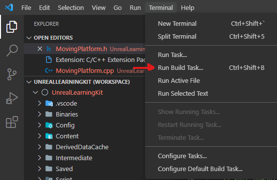
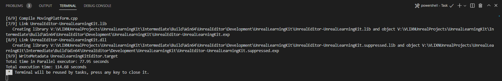

## Getting Started

1. Inside of Unreal go to Tools.

2. Select New C++ Class...

3. Select Actor and click on Next.

<br>

<div align="center">


</div>

<br>

4. Rename the actor (MovingPlatform).

5. Press Create Class.

<br>

<div align="center">


</div>

<br>

6. Close UE Editor.

7. Open VS Code.

<br>

<a name="compiling-the-editor"></a>
## Compiling The Editor

8. Inside VS Code Select Terminal.

9. Select Run Build Task (Ctrl + Shift + B).

10. Select [Project Name + Win64 Development Build].

<br>

<div align="center">



</div>

<br>

11. Wait for Terminal to finish compiling.

<br>

<div align="center">

</div>

<br>

12. Reopen UE Editor.

13. Drag C++ Actor (MovingPlatform) on to scene.

<br>
<div align="center">

</div>

<br>

14. Back to VS Code inside MovingPlatform.h script add: 

<br>

``` C
// Fill out your copyright notice in the Description page of Project Settings.

#pragma once

#include "CoreMinimal.h"
#include "GameFramework/Actor.h"
#include "MovingPlatform.generated.h"

UCLASS()
class UNREALLEARNINGKIT_API AMovingPlatform : public AActor
{
	GENERATED_BODY()
	
public:	
	// Sets default values for this actor's properties
	AMovingPlatform();

protected:
	// Called when the game starts or when spawned
	virtual void BeginPlay() override;

public:	
	// Called every frame
	virtual void Tick(float DeltaTime) override;

	UPROPERTY(EditAnywhere)
	int32 MyInt = 99;

	UPROPERTY(EditAnywhere)
	float MyFloat = 1;

	UPROPERTY(EditAnywhere)
	bool MyBool = true;

};

```

<br>

15. Save the script.

16. Inside of UE, bottom right, press Live Coding.

<br>

<div align="center">

</div>

<br>

17. Wait for Live Coding to finish compiling.

<br>

<div align="center">

</div>

<br>

18. If there are no compiler errors, check on the MovingPlatform Details Panel to see if the variables are added onto MyFirstActor.

<br>

<div align="center">

</div>

<br>
<hr>

## Common Issues with Live Coding

Data lost when reloading/reopening project. If for some reasons you realize that the previous data sets that you have created is lost.

1. Close UE Editor.

2. Repeat <a href="#compiling-the-editor">Compiling The Editor</a>
